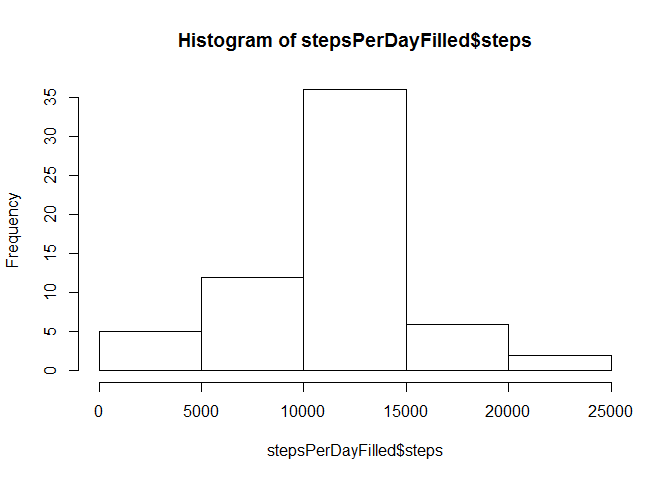

# Reproducible Research: Peer Assessment 1
PhiMin  


## Loading and preprocessing the data

Unzip and load the data:


```r
unzip("activity.zip")
activity <- read.csv("activity.csv")
```

Classes of data set columns:

```r
str(activity)
```

```
## 'data.frame':	17568 obs. of  3 variables:
##  $ steps   : int  NA NA NA NA NA NA NA NA NA NA ...
##  $ date    : Factor w/ 61 levels "2012-10-01","2012-10-02",..: 1 1 1 1 1 1 1 1 1 1 ...
##  $ interval: int  0 5 10 15 20 25 30 35 40 45 ...
```

**date** needs to be converted:

```r
# convert date info in format 'yyyy-mm-dd'
activity$date <- as.Date(activity$date, "%Y-%m-%d")
```

Summary of data set:

```r
summary(activity)
```

```
##      steps             date               interval     
##  Min.   :  0.00   Min.   :2012-10-01   Min.   :   0.0  
##  1st Qu.:  0.00   1st Qu.:2012-10-16   1st Qu.: 588.8  
##  Median :  0.00   Median :2012-10-31   Median :1177.5  
##  Mean   : 37.38   Mean   :2012-10-31   Mean   :1177.5  
##  3rd Qu.: 12.00   3rd Qu.:2012-11-15   3rd Qu.:1766.2  
##  Max.   :806.00   Max.   :2012-11-30   Max.   :2355.0  
##  NA's   :2304
```

## What is mean total number of steps taken per day?

Calculate the total number of steps taken per day:

```r
stepsPerDay <- aggregate(steps ~ date, activity, sum, na.rm=T)
```

QC check:

```r
sum(stepsPerDay$steps)
```

```
## [1] 570608
```

```r
sum(activity[!is.na(activity$steps),]$steps)
```

```
## [1] 570608
```

Make a histogram of the total number of steps taken each day, calculate and report the mean and median of the total number of steps taken per day

```r
hist(stepsPerDay$steps)
```


```r
mean(stepsPerDay$steps)
```

```
## [1] 10766.19
```

```r
median(stepsPerDay$steps)
```

```
## [1] 10765
```

## What is the average daily activity pattern?

Make a time series plot of the 5-minute interval (x-axis) and the average number of steps taken, averaged across all days (y-axis)


```r
avgStepsPerInterval <- aggregate(steps ~ interval, activity, mean)
plot(avgStepsPerInterval, type = "l")
```


Which 5-minute interval, on average across all the days in the dataset, contains the maximum number of steps?

```r
avgStepsPerInterval[avgStepsPerInterval$steps==max(avgStepsPerInterval$steps),]
```

```
##     interval    steps
## 104      835 206.1698
```

Interval 835 with approx. 206 steps contians the maximum number of steps.

## Imputing missing values

Calculate and report the total number of missing values in the dataset (i.e. the total number of rows with NAs):


```r
table(is.na(activity$steps))
```

```
## 
## FALSE  TRUE 
## 15264  2304
```

```r
table(is.na(activity$date))
```

```
## 
## FALSE 
## 17568
```

```r
table(is.na(activity$interval))
```

```
## 
## FALSE 
## 17568
```

2304 values are NA (all for steps).

Strategy for filling the NA's: mean for that 5-minute interval


```r
activityFilled <- merge(x = activity, y = avgStepsPerInterval, by="interval", all.x=T)

activityFilled[is.na(activityFilled$steps.x),]$steps.x <-  activityFilled[is.na(activityFilled$steps.x),]$steps.y

head(activityFilled)
```

```
##   interval  steps.x       date  steps.y
## 1        0 1.716981 2012-10-01 1.716981
## 2        0 0.000000 2012-11-23 1.716981
## 3        0 0.000000 2012-10-28 1.716981
## 4        0 0.000000 2012-11-06 1.716981
## 5        0 0.000000 2012-11-24 1.716981
## 6        0 0.000000 2012-11-15 1.716981
```

```r
activityFilled <- activityFilled[,c(1:3)]

names(activityFilled) <- c("interval", "steps", "date")

head(activityFilled)
```

```
##   interval    steps       date
## 1        0 1.716981 2012-10-01
## 2        0 0.000000 2012-11-23
## 3        0 0.000000 2012-10-28
## 4        0 0.000000 2012-11-06
## 5        0 0.000000 2012-11-24
## 6        0 0.000000 2012-11-15
```

Make a histogram of the total number of steps taken each day and Calculate and report the mean and median total number of steps taken per day. Do these values differ from the estimates from the first part of the assignment? What is the impact of imputing missing data on the estimates of the total daily number of steps?


```r
stepsPerDayFilled <- aggregate(steps ~ date, activityFilled, sum)

hist(stepsPerDayFilled$steps)
```



```r
mean(stepsPerDayFilled$steps)
```

```
## [1] 10766.19
```

```r
median(stepsPerDayFilled$steps)
```

```
## [1] 10766.19
```

Data for comparison from earlier:


```r
mean(stepsPerDay$steps)
```

```
## [1] 10766.19
```

```r
median(stepsPerDay$steps)
```

```
## [1] 10765
```

Mean does not change, but the median does a little bit (1 step), but the histogram shows, that the data is more centered.

## Are there differences in activity patterns between weekdays and weekends?

Create a new factor variable in the dataset with two levels - "weekday" and "weekend" indicating whether a given date is a weekday or weekend day.


```r
activityFilled$wd <- "weekday"

activityFilled[weekdays(activityFilled$date, T) %in% c("Sa", "So"),]$wd <- "weekend"

table(activityFilled$wd)
```

```
## 
## weekday weekend 
##   12960    4608
```

Make a panel plot containing a time series plot (i.e. type = "l") of the 5-minute interval (x-axis) and the average number of steps taken, averaged across all weekday days or weekend days (y-axis)


```r
avgStepsPerIntervalWithWeekday <- aggregate(steps ~ interval + wd, activityFilled, mean)

library(lattice)

xyplot(steps ~ interval | factor(wd), data=avgStepsPerIntervalWithWeekday, type = "l", layout=c(1,2))
```


